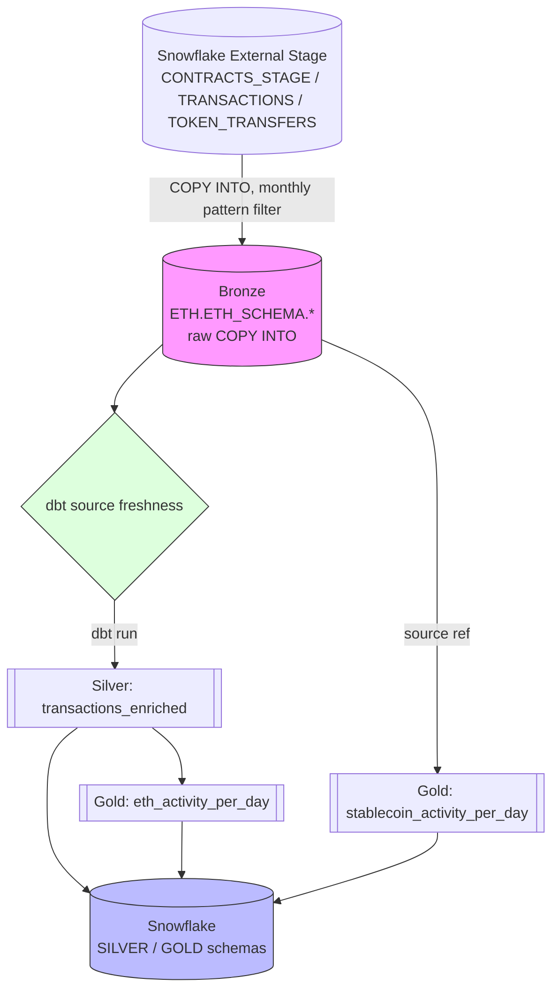
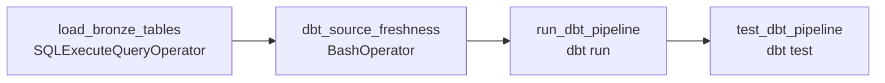
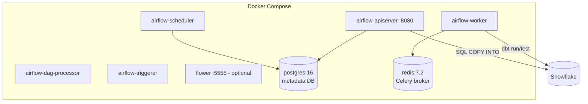

# Etherium-Project

An orchestrated, medallion-architecture data pipeline that ingests raw Ethereum blockchain data into **Snowflake**, transforms it through **dbt**, and schedules the whole thing with **Apache Airflow**, running on **Docker**.

> Repo scanned: `dags/`, `ETH_DBT/`, `config/`, `docker-compose.yaml`, `requirements.txt`, `.gitignore`. Language: 100% Python (Airflow DAG) + SQL (dbt models).

---

## 1. Architecture

### 1.1 Data flow (Medallion architecture)



### 1.2 Orchestration (Airflow DAG: `ethereum_medallion_pipeline`)



- **Schedule:** `@daily`, `start_date=2026-01-01`, `catchup=False` (only runs for "today", no backfill).
- **Retries:** 1 retry, 5-minute delay, owner `data_engineering`.

### 1.3 Infrastructure (Docker Compose)



Executor is **CeleryExecutor**, backed by Postgres (metadata) and Redis (broker) — this is the stock Airflow 3.3.0 `docker-compose.yaml` from the Apache docs, with one addition: `_PIP_ADDITIONAL_REQUIREMENTS: "dbt-snowflake"`.

---

## 2. Tech stack

| Layer | Tool | Version (pinned in repo) |
|---|---|---|
| Orchestration | Apache Airflow (CeleryExecutor) | 3.3.0 |
| Transformation | dbt-core / dbt-snowflake | 1.12.0 |
| Warehouse | Snowflake | — |
| Broker | Redis | 7.2-bookworm |
| Metadata DB | PostgreSQL | 16 |
| Containerization | Docker Compose | — |
| Language | Python | 3.x (Airflow container) |

---

## 3. Repository structure

```
Etherium-Project/
├── dags/
│   ├── ethereum_data_pipeline.py     # ← the actual Airflow DAG (this is what runs)
│   └── ETH_DBT/                      # ← the dbt project Airflow actually calls (mounted into the container)
│       ├── dbt_project.yml
│       ├── models/
│       │   ├── sources.yml           # declares source ETH.ETH_SCHEMA (CONTRACTS, TRANSACTIONS, TOKEN_TRANSFERS)
│       │   ├── silver/
│       │   │   └── transactions_enriched.sql
│       │   └── gold/
│       │       ├── eth_activity_per_day.sql
│       │       └── stablecoin_activity_per_day.sql
│       ├── macros/, seeds/, snapshots/, tests/, analyses/   # empty scaffolds (dbt init defaults)
│       └── README.md                 # default dbt-init boilerplate
├── ETH_DBT/                          # ⚠️ exact duplicate of dags/ETH_DBT — see Section 6
├── config/
│   └── airflow.cfg                   # full Airflow config, mounted to override defaults
├── docker-compose.yaml               # Airflow 3.3.0 Celery stack (Postgres + Redis + Airflow services)
├── requirements.txt                  # full pip freeze from the Airflow container (417 packages)
└── .gitignore
```

---

## 4. What each piece does

### `dags/ethereum_data_pipeline.py`
Defines the DAG `ethereum_medallion_pipeline` with 4 sequential tasks:

1. **`load_bronze_tables`** — runs a multi-statement `COPY INTO` on Snowflake (via `conn_id='snowflake_default'`) that loads `CONTRACTS`, `TRANSACTIONS`, and `TOKEN_TRANSFERS` from external stages, filtered to the current year-month.
2. **`dbt_source_freshness`** — `cd /opt/airflow/dags/ETH_DBT && dbt source freshness`, confirms bronze data actually landed before transforming.
3. **`run_dbt_pipeline`** — `dbt run`, builds the Silver and Gold models as physical tables in Snowflake.
4. **`test_dbt_pipeline`** — `dbt test`, runs dbt's data quality tests.

### `dags/ETH_DBT/models/silver/transactions_enriched.sql`
Joins `ETH.TRANSACTIONS` with an aggregated `ETH.TOKEN_TRANSFERS`, and buckets each transaction into `contract_creation`, `token_transfer`, `plain_eth_transfer`, or `other`.

### `dags/ETH_DBT/models/gold/eth_activity_per_day.sql`
Aggregates `transactions_enriched` into daily transaction counts and total ETH volume (converted from Wei by dividing by 1e18), grouped by `date` and `transaction_category`.

### `dags/ETH_DBT/models/gold/stablecoin_activity_per_day.sql`
Filters `TOKEN_TRANSFERS` directly for USDT and USDC contract addresses, and sums daily transfer volume (adjusted for 6-decimal precision).

### `docker-compose.yaml`
Standard Airflow Celery-executor stack: `postgres`, `redis`, `airflow-apiserver`, `airflow-scheduler`, `airflow-dag-processor`, `airflow-worker`, `airflow-triggerer`, `airflow-init`, plus optional `airflow-cli` and `flower` profiles. Mounts `dags/`, `logs/`, `config/`, `plugins/`, and a dbt profile directory into every Airflow container.

---

## 5. Setup instructions

### Prerequisites
- Docker + Docker Compose v2
- A Snowflake account with database `ETH`, schema `ETH_SCHEMA`, and the external stages/tables referenced in the DAG already provisioned (this repo does **not** create them — see Section 6)
- Enough free RAM for Airflow's Celery stack (Airflow's official docs recommend 4GB+ for Docker)

### Step-by-step

**1. Clone and prep folders**
```bash
git clone https://github.com/MananChoudhary/Etherium-Project.git
cd Etherium-Project
mkdir -p logs plugins
```

**2. Create `.env` at the repo root** (already gitignored)
```bash
echo -e "AIRFLOW_UID=$(id -u)" > .env
python3 -c "from cryptography.fernet import Fernet; print('FERNET_KEY=' + Fernet.generate_key().decode())" >> .env
```

**3. Fix the hardcoded dbt-profile mount in `docker-compose.yaml`**
Find this line under `x-airflow-common → volumes`:
```yaml
- /home/manan/.dbt:/home/airflow/.dbt
```
Replace it with a path that exists on *your* machine, e.g.:
```yaml
- ${AIRFLOW_PROJ_DIR:-.}/.dbt:/home/airflow/.dbt
```

**4. Create your dbt profile** at `./.dbt/profiles.yml` (gitignored, matches `profile: 'ETH_DBT'` in `dbt_project.yml`)
```yaml
ETH_DBT:
  target: dev
  outputs:
    dev:
      type: snowflake
      account: <your_snowflake_account_id>
      user: <your_username>
      password: "{{ env_var('DBT_SNOWFLAKE_PASSWORD') }}"
      role: <your_role>
      database: ETH
      warehouse: <your_warehouse>
      schema: ETH_SCHEMA
      threads: 4
```
Add `DBT_SNOWFLAKE_PASSWORD=...` to your `.env` as well.

**5. Initialize and start Airflow**
```bash
docker compose up airflow-init
docker compose up -d
```

**6. Open the UI** at `http://localhost:8080` (default login `airflow` / `airflow`).

**7. Add the Snowflake connection** the DAG expects:
Admin → Connections → `+` → Connection Id: `snowflake_default`, Connection Type: Snowflake → fill in account/user/password/warehouse/database/schema/role.

**8. Unpause and trigger** the `ethereum_medallion_pipeline` DAG from the UI, or:
```bash
docker compose run airflow-cli airflow dags unpause ethereum_medallion_pipeline
docker compose run airflow-cli airflow dags trigger ethereum_medallion_pipeline
```

---

## 6. Things you need to fix in this repo (found while reviewing)

| File | Issue | Fix |
|---|---|---|
| `dags/ethereum_data_pipeline.py` (lines 12–13) | `DBT_PROJECT_DIR` and `DBT_EXECUTABLE` are hardcoded Windows paths (`C:\Ethereum Project\...`) and are **never actually used** — the real `BashOperator` commands hardcode `/opt/airflow/dags/ETH_DBT` instead. Dead, misleading code. | Delete the two unused variables, or replace the hardcoded Linux path in the bash commands with a reference to them (`f'cd {DBT_PROJECT_DIR} && dbt run'`) for one source of truth. |
| `ETH_DBT/` (repo root) vs `dags/ETH_DBT/` | These two folders are byte-for-byte duplicates. Only `dags/ETH_DBT/` is actually used, because Airflow mounts `./dags` into the container and the DAG's bash tasks `cd` into `/opt/airflow/dags/ETH_DBT`. The root-level `ETH_DBT/` does nothing and just creates confusion about which copy to edit. | Delete the root-level `ETH_DBT/` folder. Keep a single dbt project under `dags/ETH_DBT/`. |
| `docker-compose.yaml` (volumes) | `/home/manan/.dbt:/home/airflow/.dbt` is hardcoded to one person's home directory — breaks for anyone else cloning the repo. | Use a relative path as shown in Setup Step 3. |
| `requirements.txt` | This is a full `pip freeze` of the running container (417 packages, including Airflow itself and every provider). It's not meant to be `pip install -r requirements.txt`'d on a fresh machine — Docker already pulls the pinned `apache/airflow:3.3.0` image. | Keep it as a reference/lockfile for rebuilding a custom image if you ever add `build: .` to `docker-compose.yaml`. Don't run it locally unless you're intentionally recreating the container's Python env. |
| Snowflake bronze layer | The `COPY INTO` statements assume `@ETH.ETH_SCHEMA.CONTRACTS_STAGE` and equivalent stages, plus the target tables, already exist in Snowflake. Nothing in this repo creates them. | Document (or add as a dbt seed/setup script) the `CREATE STAGE` / `CREATE TABLE` DDL so a new environment can be bootstrapped from scratch. |
| `.gitignore` | Correctly excludes `profiles.yml`, `.env`, `*.pem`, `*.p8` — good, keep secrets out of git. | No action needed, just confirming it's already handled correctly. |

---

## 7. Notes on the pipeline logic

- The bronze load pattern `CURRENT_DATE() - 3` subtracts **3 days**, not 3 months, before extracting `YYYY-MM` — in practice this only changes behavior near a month boundary. Worth double-checking this is the intended freshness window.
- `catchup=False` means if the DAG is paused for a few days, those days are **not** backfilled automatically — you'd need to trigger manual runs for missed dates.
- All dbt models are materialized as physical **tables** (`+materialized: table` in `dbt_project.yml`), not views/incremental — every `dbt run` does a full rebuild.

---

## 8. Roadmap ideas

- [ ] Add dbt tests (`schema.yml` with `not_null` / `unique` on `hash`, `transaction_hash`)
- [ ] Parameterize the Snowflake stage names via dbt variables instead of hardcoding in the DAG's SQL
- [ ] Add a `plugins/` and CI (GitHub Actions) step to run `dbt run --target ci` against a scratch schema on PRs
- [ ] Replace the raw `COPY INTO` BashOperator/SQL block with a dedicated Snowflake ingestion tool (Snowpipe or an Airflow Snowflake provider hook) for better observability
