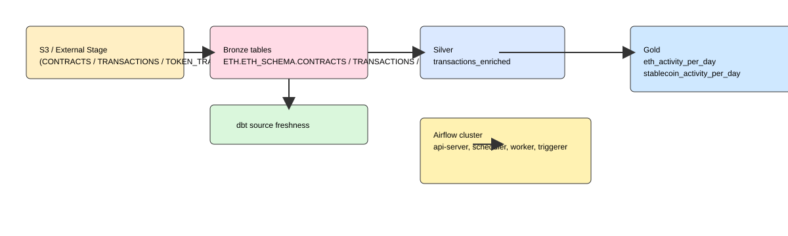

# Etherium-Project

One-line summary
This repository is an Airflow-orchestrated medallion pipeline that ingests Ethereum raw files into Snowflake (Bronze), runs dbt to transform data into Silver and Gold models, and validates quality with dbt tests. It's aimed at data engineers who want a reproducible local/dev setup (Docker Compose) that mirrors a Snowflake + dbt + Airflow workflow.

Table of contents
- What this is
- Architecture (diagram)
- Stack & notable versions
- Repository layout (what matters)
- How the pipeline runs (runtime flow)
- Complete setup & run instructions (zero-to-running)
- Files/config you must change (and why)
- Production checklist & hardening notes
- Troubleshooting
- Next steps & maintenance notes

## What this is
An end-to-end local development pipeline: Airflow (CeleryExecutor) triggers a Snowflake "COPY INTO" bronze load from external stages, runs dbt (source freshness -> run -> test) to produce Silver and Gold tables, and stores results in the Snowflake database/schemas (ETH / ETH_SCHEMA, plus dbt silver/gold schemas).

### Stack
- Language(s): Python (Airflow DAGs), SQL (dbt models)
- Runtime / Framework: Apache Airflow (CeleryExecutor) via Docker Compose; dbt-core / dbt-snowflake; Snowflake as the data warehouse
- Notable libraries: apache-airflow (3.3.0), dbt-core (1.12.0) + dbt-snowflake, snowflake-connector-python

## Architecture (visual)
Below is a concise diagram of the data + orchestration flow. An editable Excalidraw file is included in /docs (open at excalidraw.com → File → Import → select the .excalidraw.json file).



Open editable version in Excalidraw:
- File: ./docs/architecture.excalidraw.json
- To edit: go to https://excalidraw.com/ → File → Import → choose the JSON file, or drag-and-drop the JSON onto the canvas.

## How it’s organized (top-level)
```
Etherium-Project/
├── dags/
│   └── ethereum_data_pipeline.py      # Airflow DAG that runs the pipeline
│   └── ETH_DBT/                       # duplicate dbt project copy (mounted into Airflow container)
├── ETH_DBT/                           # dbt project (models, dbt_project.yml, sources.yml)
├── config/
│   └── airflow.cfg                     # optional override for Airflow
├── docker-compose.yaml                # local/dev Airflow Celery stack + postgres + redis
├── requirements.txt                   # Python package list used with the Airflow image
└── README.md
```

How it fits together
- Airflow runs the DAG `ethereum_medallion_pipeline`: COPY INTO (Snowflake) → dbt source freshness → dbt run → dbt test.
- dbt models live in `ETH_DBT/models/`; dbt_project.yml configures materialization into `silver` and `gold` schemas.
- The docker-compose mounts the repository into the Airflow containers and expects a dbt profile at `~/.dbt/profiles.yml` (the compose file currently mounts `/home/manan/.dbt` and has been updated to be portable).

## How to run it (shortest path)
Prereqs:
- Docker & Docker Compose v2
- A Snowflake account with:
  - database: `ETH`
  - schema: `ETH_SCHEMA`
  - external stages referenced in DAG: `@ETH.ETH_SCHEMA.CONTRACTS_STAGE`, `@ETH.ETH_SCHEMA.TRANSACTIONS`, `@ETH.ETH_SCHEMA.TOKEN_TRANSFERS` (the repo assumes these exist)
- At least 4GB RAM recommended for Docker in this stack

Commands:
```bash
git clone https://github.com/MananChoudhary/Etherium-Project.git
cd Etherium-Project

# create folders used by compose
mkdir -p logs plugins .dbt

# Create .env (set AIRFLOW_UID and secret keys)
echo -e "AIRFLOW_UID=$(id -u)" > .env
python3 -c "from cryptography.fernet import Fernet; print('FERNET_KEY=' + Fernet.generate_key().decode())" >> .env

# Edit docker-compose.yaml if needed (dbt mount now uses AIRFLOW_PROJ_DIR env var)
# Create dbt profiles at ./.dbt/profiles.yml (example below)
# Add DBT_SNOWFLAKE_PASSWORD and other secrets to .env

# Initialize and start Airflow
docker compose up airflow-init
docker compose up -d

# Open UI: http://localhost:8080 (default airflow / airflow)
# Add Snowflake connection in UI: snowflake_default
# Unpause & trigger DAG:
docker compose run airflow-cli airflow dags unpause ethereum_medallion_pipeline
docker compose run airflow-cli airflow dags trigger ethereum_medallion_pipeline
```

## dbt profile example (create at ./.dbt/profiles.yml)
```yaml
ETH_DBT:
  target: dev
  outputs:
    dev:
      type: snowflake
      account: <your_snowflake_account>
      user: <your_user>
      password: "{{ env_var('DBT_SNOWFLAKE_PASSWORD') }}"
      role: <your_role>
      database: ETH
      warehouse: <your_warehouse>
      schema: ETH_SCHEMA
      threads: 4
```
Add `DBT_SNOWFLAKE_PASSWORD=...` to `.env`.

## Required local edits & gotchas (you must do these)
1. docker-compose: change/update the dbt mount if you haven't already
   - The compose file now uses `${AIRFLOW_PROJ_DIR:-.}/.dbt:/home/airflow/.dbt` — set `AIRFLOW_PROJ_DIR` in `.env` if you need a different base path.

2. DAG Windows paths: the DAG now reads DBT_PROJECT_DIR and DBT_EXECUTABLE from env vars (or falls back to container-friendly defaults). Ensure the mounted `ETH_DBT` path matches `/opt/airflow/dags/ETH_DBT` inside the container.

3. Duplicate dbt project and conflicting dbt settings
   - There are two dbt_project.yml files (ETH_DBT/dbt_project.yml and dags/ETH_DBT/dbt_project.yml). One sets `+materialized: table`, the other sets `+materialized: incremental`. Decide which is intended and reconcile.

4. COPY INTO date pattern
   - The DAG sets CURRENT_MONTH_PATTERN using `CURRENT_DATE() - 3` (3 days). Verify extraction logic if you expect monthly patterns.

5. Snowflake external stages & privileges
   - The repo does NOT provision Snowflake external stages/tables. Ensure you (or infra) create them, and provide the Snowflake user with appropriate privileges to read stages and write to target schemas.

6. Secrets & credentials
   - Do NOT hard-code Snowflake credentials. Use Airflow Connections (UI) and env vars for DBT password. Consider a secrets backend for production.

## Logging, monitoring, and resource sizing
- Airflow Docker Compose shows resource warnings if <4GB RAM or <2 CPUs. For local testing use at least 4GB.
- The compose file uses CeleryExecutor backed by Redis + Postgres. For production consider KubernetesExecutor or managed Airflow.

## Production checklist (short)
- Remove hard-coded paths and use env vars / Airflow connections / secrets backends
- Reconcile dbt materialization (table vs incremental) and test incremental logic
- Add proper dbt sources/tests for freshness, uniqueness, null checks
- Restrict Snowflake user permissions to least privilege
- Use CI to run dbt tests on PRs
- Add baseline monitoring/alerts for DAG failures and job retries

## Troubleshooting tips
- If dbt commands fail inside Airflow container: exec into airflow-cli container (docker compose run airflow-cli bash) and run `cd /opt/airflow/dags/ETH_DBT && dbt debug`.
- If COPY INTO returns zero files: verify stages exist and PATTERN logic matches.
- If permission errors: check Snowflake user role + grants.

## Files of interest (quick navigation)
- `dags/ethereum_data_pipeline.py` — DAG logic and Snowflake COPY INTO SQL
- `ETH_DBT/models/` — dbt models (silver/ and gold/)
- `ETH_DBT/models/sources.yml` — dbt source declarations for ETH.ETH_SCHEMA
- `docker-compose.yaml` — local Airflow stack; edit volumes & _PIP_ADDITIONAL_REQUIREMENTS if needed

